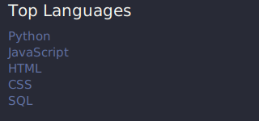

 <h1 align="center">
    
</h1>

<h3 align="center">Software Developer from Poland</h3>

  
  

###

  
  

###

 
<picture>
  <source media="(prefers-color-scheme: dark)" srcset="github-contribution-grid-snake-dark.svg" />
  <source media="(prefers-color-scheme: light)" srcset="github-contribution-grid-snake.svg" />
  
</picture>

  

    
  

<h3 align="center">Connect with me:</h3>

  

<h3 align="center">Languages and Tools:</h3>

 
   
   
   
   
   
   
   
   
   
   
   
   
   
   
   
   
   
   
   
   
   
  <a href="https://vuejs.org/" target="_blank" rel="noreferrer">

